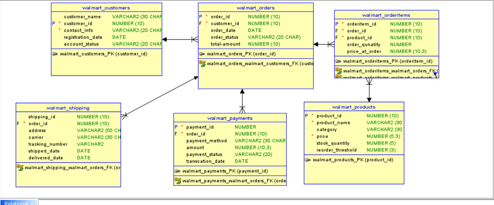

# Order Management & Billing System (Oracle PL/SQL)

An end-to-end order management and billing system built in Oracle PL/SQL, modeled on a Walmart-style e-commerce workflow. It covers the full order lifecycle — creation, confirmation, cancellation, payment validation, automatic audit logging, and scheduled cleanup of stale orders — using stored procedures, triggers, and batch jobs.

## Tech Stack

- Oracle Database 11g
- PL/SQL (procedures, triggers, bulk operations)
- Oracle SQL Developer Data Modeler (schema design)

## Schema



7 tables, all keyed off `walmart_orders`:

| Table | Purpose | Keys |
|---|---|---|
| `walmart_customers` | Customer details and account status | PK: `customer_id` |
| `walmart_orders` | One row per order | PK: `order_id`, FK: `customer_id` |
| `walmart_orderitems` | Line items per order (product, quantity, price at time of order) | PK: `order_item_id`, FK: `order_id`, `product_id` |
| `walmart_products` | Product catalog and stock levels | PK: `product_id` |
| `walmart_payments` | Payment records (method, amount, status) | PK: `payment_id`, FK: `order_id` |
| `walmart_shipping` | Shipping/tracking details | PK: `shipping_id`, FK: `order_id` |
| `walmart_logs` | Audit trail of every order change | populated automatically via trigger |

## Business Rules Implemented

- An order can't be confirmed unless there's sufficient stock.
- Only customers with an active account can place orders.
- Payment amount must match the order total before it's accepted.
- Confirming an order automatically decrements product stock.
- Cancelling an order automatically restores stock.
- Every insert/update/delete on `walmart_orders` is audit-logged automatically via trigger.
- Orders left in `PENDING` for more than 1 day are automatically cancelled by a batch job.

## Key PL/SQL Objects

**Procedures**

| Procedure | What it does |
|---|---|
| `validate_customer_active` | Raises an error unless the customer's account status is `ACTIVE` |
| `validate_order_stock` | Raises an error if requested quantity exceeds available stock (uses BULK COLLECT) |
| `validate_payment_amount` | Raises an error if payment amount doesn't match the order total |
| `create_order` | Validates the customer, then inserts a new `PENDING` order |
| `confirm_order` | Validates stock, decrements it (BULK COLLECT + FORALL), and sets status to `CONFIRMED` |
| `cancel_order` | Restores stock and sets status to `CANCELLED` |
| `batch_cancel_stale_orders` | Cancels any order still `PENDING` after 1 day |

**Triggers**

| Trigger | What it does |
|---|---|
| `walmart_logs_trg` | AFTER INSERT/UPDATE/DELETE row-level trigger on `walmart_orders`; writes action, old/new status, `changed_by`, and `changed_on` to `walmart_logs` |

All custom error codes use the reserved Oracle range `-20000` to `-20999`, with a distinct number per validation failure (insufficient stock, inactive account, customer not found, payment mismatch).

## Setup Instructions

```bash
1. Run ddl/schema.sql          # creates tables, constraints, indexes
2. Run procedures/*.sql        # compiles all procedures
3. Run triggers/*.sql          # compiles triggers
4. Run data/sample_inserts.sql # optional sample data
```

## Incidents / Lessons Learned

Three real debugging incidents from building this project — trigger validation, transaction visibility, and identifier length limits — are documented in [`docs/incidents.md`](docs/incidents.md). This is worth a look: it's the part of the project that shows debugging process, not just working code.

## Author

**Y. Gopi Krishna**
[LinkedIn](https://www.linkedin.com/in/gopi-krishna-y-3961b7318/)
